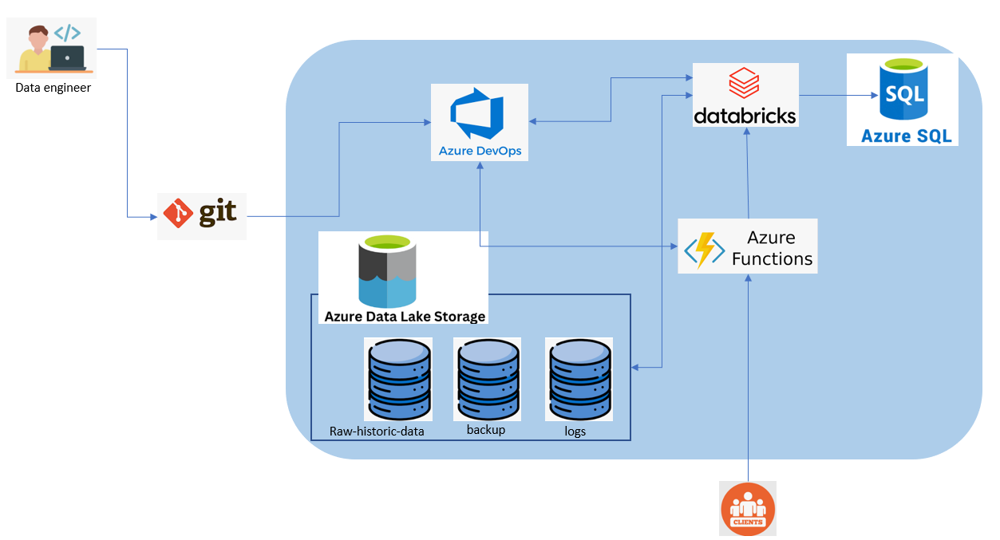
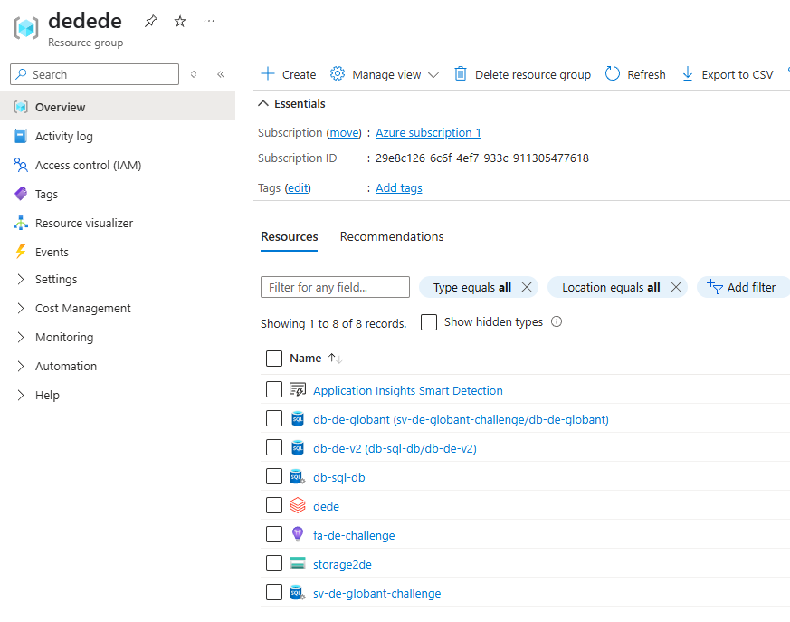

# Data Engineer Challenge
## Architecture

This section provides a detailed explanation of how the architecture presented below was designed, focusing on the Azure cloud with an emphasis on Databricks.

I had to evaluate several options, mainly for the development of the REST API. Frameworks like Flask or FastAPI were initially considered, but I preferred to go with an option that is native to Azure due to its easy configuration and integration with other Azure services. Additionally, it is a fully managed tool by Azure, so we won't face scalability issues. The API was configured to respond to HTTP requests, making it easier to test directly from Databricks.

## Setup

For the architecture setup, a resource group was created along with all the services that would be used for this project. 
1. **For storage**: I used Azure Data Lake Storage because it is the most popular storage service in Azure, and it allows easy integration with other tools like Databricks.
2. **Database**: I used SQL Database because the project requires it, instead i would use databricks also
3. **Processing Data**: I used Azure Databricks because it is the most popular service for processing data and its largely used.

## What to improve
I would improve the security applied to my architecture. Since this development was solely for the purposes of this challenge, I didn’t focus much on protecting sensitive information. I would also change some configurations to make the project more scalable. Additionally, I would enhance the architecture, as for this PoC, I tried to use as many services as possible.

